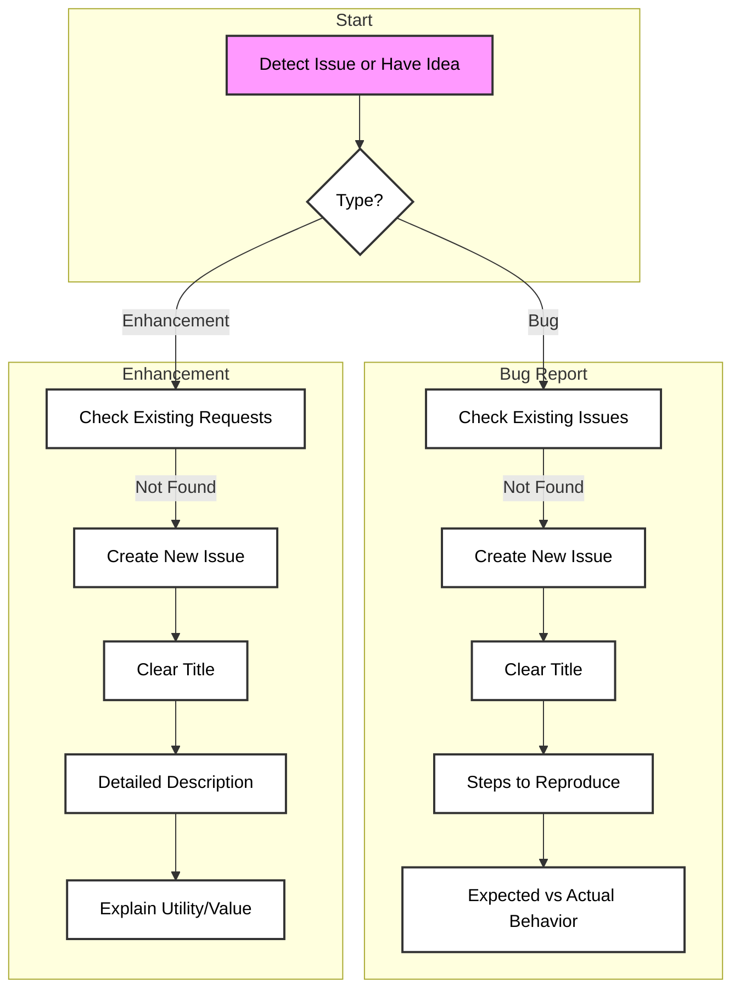
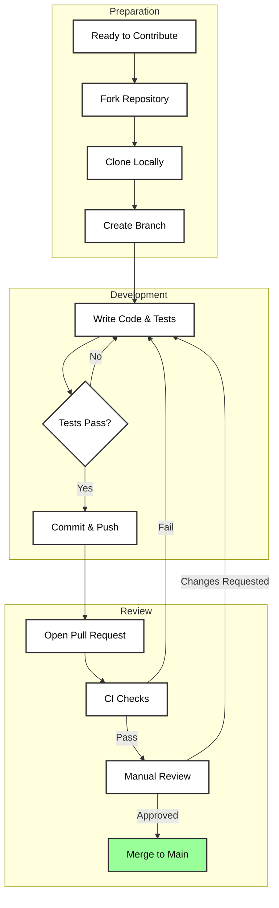

# Contributing to NxtGenCore

Thank you for your interest in contributing to NxtGenCore. This document outlines the standards and process for contributing to the project.

---

## Code of Conduct

This project and everyone participating in it is governed by a standard Code of Conduct. By participating, you are expected to uphold this code. Please report unacceptable behavior to the maintainers.

### Reporting Issues

The following diagram illustrates how to report bugs or suggest enhancements.



### Pull Request Workflow

Once you are ready to contribute code, follow this workflow.



---

## Development Guide

### Setup

1.  **Install dependencies**:
    ```bash
    npm install
    ```
2.  **Environment Variables**:
    Copy `.env.example` to `.env` and fill in the required values.
    ```bash
    cp .env.example .env
    ```
3.  **Start Development Server**:
    ```bash
    npm run dev
    ```

### Project Structure

- `server/`: Backend logic, API routes, and bot commands.
- `shared/`: Shared types and schema definitions (Drizzle ORM).
- `client/`: Frontend dashboard code (if applicable).
- `.github/`: CI/CD workflows.

### Testing

We use [Vitest](https://vitest.dev/) for testing.

*   Run all tests:
    ```bash
    npm test
    ```
*   Run tests in watch mode:
    ```bash
    npm test -- --watch
    ```

**Requirement**: All new features must include unit tests. PRs with failing tests will be automatically rejected by CI.

---

## Style Guide

### TypeScript

- Use **TypeScript** for all new code.
- Avoid `any` types whenever possible. Use explicit types or interfaces.
- Interfaces over Types generally.

### No Emojis

*   **Strict Rule**: Do not use emojis in:
    *   Code comments
    *   Commit messages
    *   Documentation (except this welcome message)
    *   Pull Request titles
*   Keep it professional and clean.

---

## Review Process

All Pull Requests go through a strict review process:

1.  **Automated CI Checks**: GitHub Actions will automatically run `npm test`. If this fails, the PR cannot be merged.
2.  **Manual Code Review**: A maintainer (e.g., **Marshal**) must manually review the code.
3.  **Approval**: Changes will only be merged after explicit approval from a maintainer.

**Do not merge your own PRs.**
