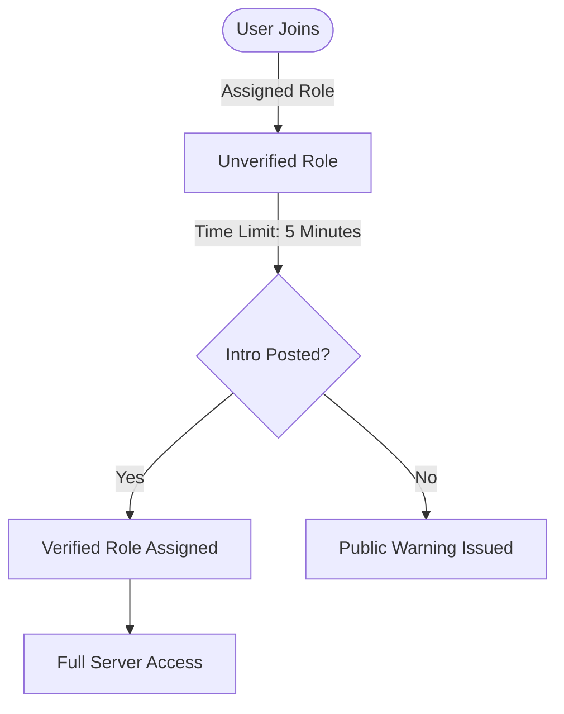

# NXT GEN Core

NXT GEN Core is a comprehensive Discord bot designed to automate server management, enhance user engagement, and provide robust moderation tools. It features a seamless onboarding system, a high-quality music player, and a suite of utility commands, all powered by a multi-server architecture.

## System Architecture

The following diagram illustrates the core onboarding and verification flow:



## Command Reference

### Core & Setup
| Command | Description |
| :--- | :--- |
| `/setup` | Initiates the interactive setup process for the server (channel config, roles, etc.). |
| `/status` | Displays your current verification status, join time, and linked introduction. |
| `/ping` | Checks the bot's latency and system status. |

### Music System
| Command | Description |
| :--- | :--- |
| `/play <song>` | Joins the voice channel and plays the requested song or playlist. |
| `/stop` | Stops playback and disconnects the bot. |
| `/skip` | Skips the current track. |
| `/queue` | Displays the current music queue. |
| `!mhistory` | Shows the last 10 played songs and allows re-queueing. |
| `!mlock` | Locks music controls to administrators only. |
| `!munlock` | Unlocks music controls for all users. |

### Moderation & Administration
| Command | Description |
| :--- | :--- |
| `/warnuser` | Sends a private warning to a user (custom or actionable templates). |
| `/scan` | Manually scans the introduction channel to verify users. |
| `/admhelp` | Allows administrators to mention a user or send a custom message to a channel. |

### Utilities & Tools
| Command | Description |
| :--- | :--- |
| `/weather` | Fetches detailed weather information for a specified location. |
| `/wish` | Sends a contextual celebration message (birthday, promotion, etc.). |
| `/aihelp` | Queries the local LLaMA 3 AI for assistance. |
| `/stealemojis` | Imports emojis from another server (requires command input). |
| `/stealreactions` | Imports all reaction emojis from a specific message. |
| `/stealsticker` | Imports a sticker from a message ID. |

## Installation & Self-Hosting

1.  **Clone the repository**
2.  **Install dependencies**:
    ```bash
    npm install
    ```
3.  **Configure Environment**:
    - Copy `.env.example` to `.env`
    - Fill in the required tokens and API keys.
4.  **Run the bot**:
    ```bash
    npm run dev
    ```

---
*Generated for NXT GEN Core v0.4.0*
