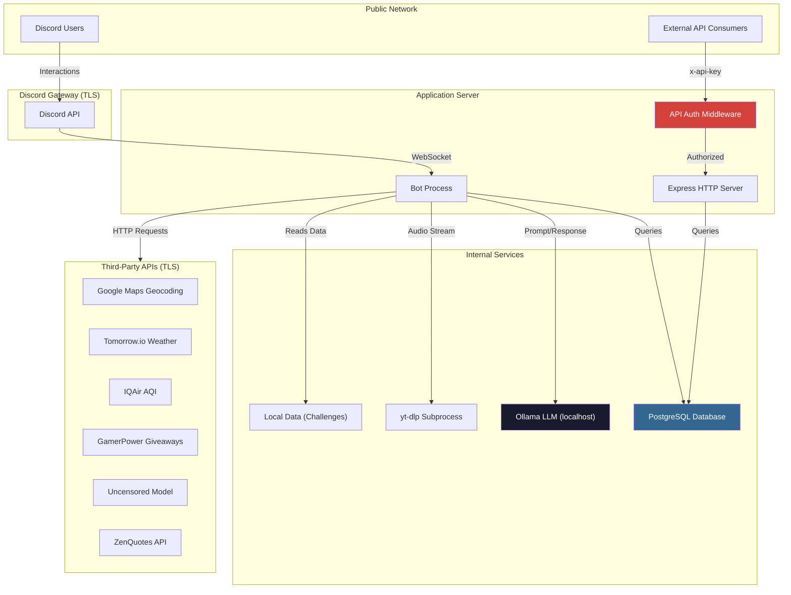
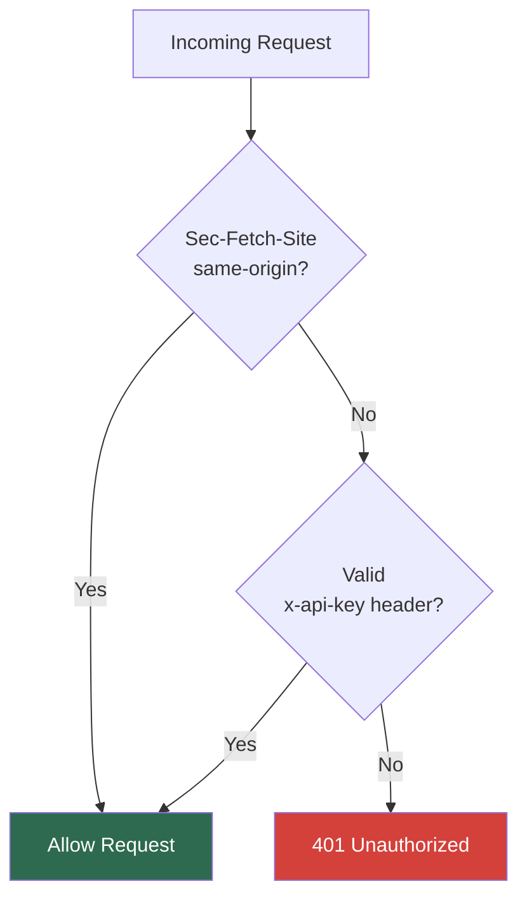

# Security Policy

This document outlines the security architecture, threat mitigations, and operational guidelines for the NxtGenCore Discord Bot. It is intended for maintainers, contributors, and anyone deploying this software in a production environment.

---

## Architecture Overview

The following diagram illustrates the trust boundaries and data flow across the system. Each boundary represents a distinct security domain.



---

## Authentication and Authorization

### Discord Commands

All slash commands are authenticated through Discord's interaction verification. Admin-restricted commands enforce permissions at registration time via `setDefaultMemberPermissions(PermissionFlagsBits.Administrator)`.

| Command | Required Permission |
|---|---|
| `/setup` | Administrator |
| `/scan` | Administrator |
| `/admhelp` | Administrator |
| `/warnuser` | Administrator |
| `/stealemoji` | Manage Guild Expressions |
| `/stealsticker` | Manage Guild Expressions |
| `/stealreactions` | Manage Guild Expressions |
| All other commands | None (public) |

### Dashboard API

The HTTP API layer (`/api/*`) is protected by a middleware that enforces a dual-path authentication model:



- **Same-origin requests** from the frontend (served by the same Express instance) are permitted automatically based on the `Sec-Fetch-Site` header.
- **External or programmatic requests** must include an `x-api-key` header matching the `API_SECRET` environment variable.
- All other requests are rejected with `401 Unauthorized`.

---

## Secrets Management

All sensitive credentials are stored in the `.env` file, which is excluded from version control via `.gitignore`. No secret values are logged, printed to stdout, or exposed through any API response.

| Variable | Purpose | Exposure Risk |
|---|---|---|
| `DISCORD_TOKEN` | Bot authentication with Discord Gateway | Full bot compromise |
| `DATABASE_PASSWORD` | PostgreSQL authentication | Database breach |
| `DATABASE_URL` | Full connection string (alternative to individual params) | Database breach |
| `API_SECRET` | Dashboard API key for external access | Unauthorized data access |
| `GOOGLE_MAPS_API_KEY` | Geocoding requests | Quota abuse / billing |
| `TOMORROW_API_KEY` | Weather data retrieval | Quota abuse |
| `IQAIR_API_KEY` | Air quality data retrieval | Quota abuse |

`cookies.txt` (YouTube session cookies for `yt-dlp`) is also git-ignored and should be treated as a credential. Rotate periodically.

---

## External Service Integration

### AI Endpoint (Ollama)

The `/aihelp` command communicates with a locally hosted Ollama instance. To prevent prompt injection, system instructions and user input are passed as structurally separate fields in the API payload:

```
{
  "system": "<system instructions>",
  "prompt": "<user input>"
}
```

The AI endpoint must remain bound to `localhost` and should never be exposed to the public network.

### yt-dlp (Audio Playback)

Audio streaming invokes `yt-dlp` as a child process using Node's `execFile` and `spawn` APIs, which do not pass arguments through a shell interpreter. This eliminates shell injection as an attack vector. All process references are tracked per guild and cleaned up on stop, skip, or disconnect.

### Third-Party HTTP APIs

Outbound requests to Google Maps, Tomorrow.io, IQAir, GamerPower, and ZenQuotes are made server-side over HTTPS. API keys (where required) are included only in server-to-server requests and are never embedded in client-facing responses or Discord messages.

---

## Data Handling

### Storage Scope

All user data is scoped per guild using a composite `(guild_id, discord_id)` key constraint. Data from one Discord server is never queryable or visible from another.

### Stored Fields

The following is the full extent of user data persisted in the database:

| Field | Type | Purpose |
|---|---|---|
| `discord_id` | bigint | User identifier |
| `guild_id` | bigint | Server identifier |
| `username` | text | Display name at time of join |
| `joined_at` | timestamp | Server join date |
| `introduction_message_id` | bigint | Reference to intro message |
| `is_active` | boolean | Whether user is still in server |

No message content, passwords, authentication tokens, or personally identifiable information beyond Discord usernames is stored.

### Discord Snowflake Handling

All Discord IDs are stored as PostgreSQL `bigint` to prevent JavaScript floating-point precision loss that occurs with standard `number` types for values exceeding `2^53`.

---

## Rate Limiting and Abuse Prevention

| Mechanism | Scope | Limit |
|---|---|---|
| `/scan` cooldown | Per guild | 5 minutes after completion |
| Public Web Requests | Per IP | 100 requests / 15 minutes |
| Logger rate limit | Global | 3-second minimum interval between log messages |
| Discord built-in | Per interaction | Enforced by Discord Gateway |

---

## Known Limitations

- **Dashboard auth is shared-secret based.** The `API_SECRET` model is suitable for single-operator deployments. Multi-tenant or multi-user dashboard access would require per-user token authentication (e.g., OAuth2 or JWT).
- **Log channel may contain stack traces.** The `logError` function sends error details (including stack traces) to a configured Discord channel. This channel should be restricted to bot operators only.
- **No pagination cap on `/scan`.** The scan command fetches all messages in a target channel. Extremely large channels (100k+ messages) may cause elevated memory usage or Discord API rate limiting.

---

## Vulnerability Reporting

If you discover a security vulnerability, we appreciate your help in disclosing it to us in a responsible manner.

Please email **[ranveerminhas@proton.me](mailto:ranveerminhas@proton.me)** with a description of the vulnerability and steps to reproduce. We will acknowledge your report and work to resolve the issue promptly. Please do not disclose the vulnerability publicly until it has been addressed.

---

## Review and Acknowledgments

This security policy was reviewed by **Marshal** and validated through automated analysis using a *custom-trained* security auditing model.
